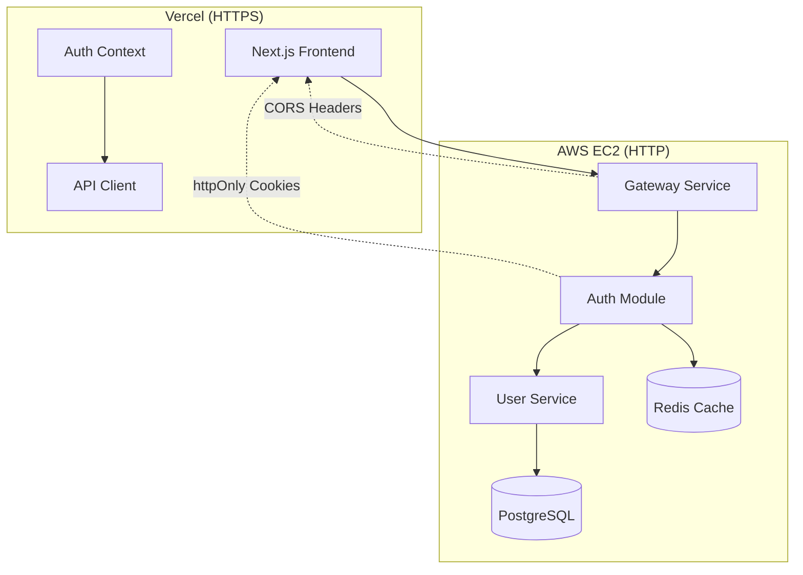
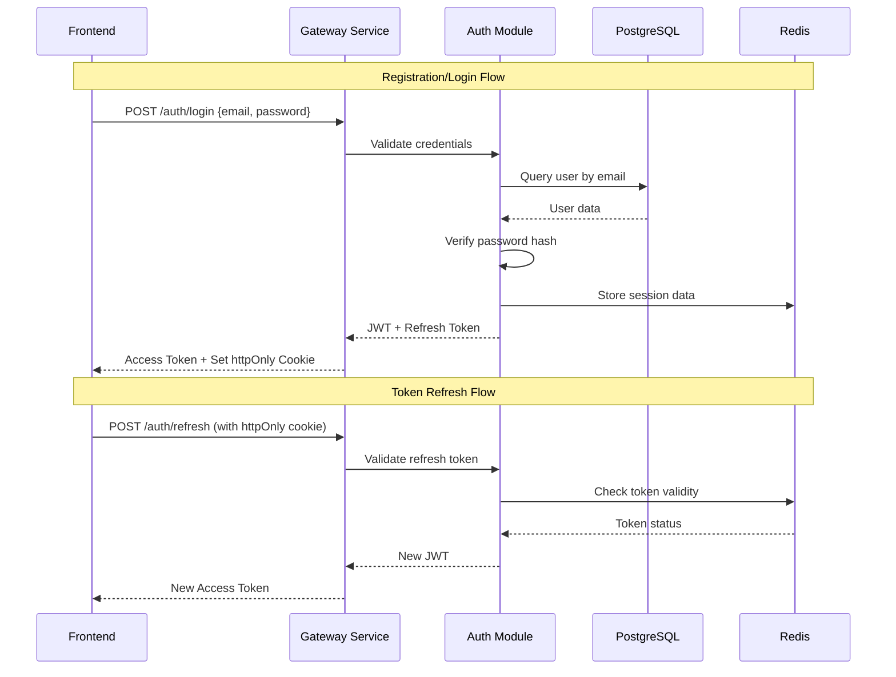

# User Authentication System Design

## Overview

The User Authentication System implements a hybrid security architecture that enables secure cross-domain communication between the Vercel-hosted Next.js frontend (HTTPS) and AWS EC2-hosted NestJS backend (HTTP). The system uses JWT access tokens stored in memory on the frontend and httpOnly refresh tokens stored as secure cookies to provide seamless authentication while maintaining security best practices.

## Architecture

### High-Level Architecture



### Authentication Flow



## Components and Interfaces

### Frontend Components (Nexus-FE)

#### 1. Authentication Context Provider

**Purpose:** Centralized authentication state management across the application

**Key Features:**
- In-memory access token storage
- Automatic token refresh logic
- Authentication state persistence
- Protected route handling

**Interface:**
```typescript
interface AuthContextType {
  user: User | null;
  isAuthenticated: boolean;
  isLoading: boolean;
  login: (email: string, password: string) => Promise<void>;
  register: (userData: RegisterData) => Promise<void>;
  logout: () => Promise<void>;
  refreshToken: () => Promise<string>;
}
```

#### 2. API Client with Interceptors

**Purpose:** Centralized HTTP client with automatic token management

**Key Features:**
- Request interceptor to add Authorization headers
- Response interceptor for automatic token refresh
- Error handling for authentication failures
- Retry logic for failed requests

**Interface:**
```typescript
interface ApiClient {
  get<T>(url: string): Promise<T>;
  post<T>(url: string, data: any): Promise<T>;
  put<T>(url: string, data: any): Promise<T>;
  delete<T>(url: string): Promise<T>;
}
```

#### 3. Authentication Forms

**Components:**
- `LoginForm`: Email/password login with validation
- `RegisterForm`: User registration with client-side validation
- `ProfileForm`: Profile management and password updates

**Validation:**
- Email format validation using regex
- Password strength requirements (8+ chars, mixed case, numbers, symbols)
- Real-time validation feedback
- Form submission state management

#### 4. Protected Route Component

**Purpose:** Route-level authentication guard

**Features:**
- Automatic redirect to login for unauthenticated users
- Loading states during authentication checks
- Nested route protection
- Role-based access control ready

### Backend Components (Nexus-BE)

#### 1. Gateway Service Architecture

**Purpose:** API Gateway and authentication orchestration

**Structure:**
```
gateway-service/
├── src/
│   ├── auth/
│   │   ├── auth.controller.ts
│   │   ├── auth.service.ts
│   │   ├── auth.module.ts
│   │   └── guards/
│   │       ├── jwt-auth.guard.ts
│   │       └── refresh-token.guard.ts
│   ├── users/
│   │   ├── users.controller.ts
│   │   └── users.service.ts
│   ├── common/
│   │   ├── decorators/
│   │   ├── filters/
│   │   └── interceptors/
│   └── main.ts
```

#### 2. Authentication Module

**Core Services:**

**AuthService:**
```typescript
interface AuthService {
  register(userData: RegisterDto): Promise<AuthResponse>;
  login(credentials: LoginDto): Promise<AuthResponse>;
  refreshToken(refreshToken: string): Promise<TokenResponse>;
  logout(userId: string, tokenId: string): Promise<void>;
  validateToken(token: string): Promise<JwtPayload>;
}
```

**JwtService Integration:**
- Access token generation (30-minute expiration)
- Refresh token generation (7-day expiration)
- Token validation and parsing
- Token blacklisting for logout

#### 3. User Service

**Purpose:** User data management and profile operations

**Interface:**
```typescript
interface UserService {
  create(userData: CreateUserDto): Promise<User>;
  findByEmail(email: string): Promise<User>;
  findById(id: string): Promise<User>;
  updateProfile(id: string, updates: UpdateUserDto): Promise<User>;
  updatePassword(id: string, passwordData: UpdatePasswordDto): Promise<void>;
  validatePassword(plainPassword: string, hashedPassword: string): Promise<boolean>;
}
```

#### 4. Security Middleware

**CORS Configuration:**
```typescript
const corsOptions = {
  origin: process.env.FRONTEND_URL, // Vercel domain
  credentials: true,
  methods: ['GET', 'POST', 'PUT', 'DELETE', 'OPTIONS'],
  allowedHeaders: ['Content-Type', 'Authorization'],
};
```

**Rate Limiting:**
- Login attempts: 5 per 15 minutes per IP
- Registration: 3 per hour per IP
- Token refresh: 10 per minute per user
- General API: 100 per minute per user

## Data Models

### User Entity (PostgreSQL)

```typescript
interface User {
  id: string; // UUID
  email: string; // Unique, indexed
  password: string; // bcrypt hashed
  firstName: string;
  lastName: string;
  createdAt: Date;
  updatedAt: Date;
  lastLoginAt?: Date;
  isActive: boolean;
  emailVerified: boolean;
}
```

### Session Data (Redis)

```typescript
interface SessionData {
  userId: string;
  tokenId: string;
  refreshToken: string;
  expiresAt: Date;
  ipAddress: string;
  userAgent: string;
}
```

### JWT Payload Structure

```typescript
interface JwtPayload {
  sub: string; // User ID
  email: string;
  tokenId: string; // For token invalidation
  iat: number;
  exp: number;
}
```

## Error Handling

### Frontend Error Handling

**Authentication Errors:**
- 401 Unauthorized → Automatic token refresh attempt
- 403 Forbidden → Redirect to login with message
- 422 Validation Error → Display field-specific errors
- 429 Rate Limited → Display retry message with countdown

**Error Boundaries:**
- Global error boundary for unhandled authentication errors
- Form-level error handling for validation
- Network error handling with retry options

### Backend Error Handling

**Custom Exception Filters:**
```typescript
@Catch(UnauthorizedException)
export class AuthExceptionFilter implements ExceptionFilter {
  catch(exception: UnauthorizedException, host: ArgumentsHost) {
    // Clear httpOnly cookies on auth failures
    // Log security events
    // Return standardized error response
  }
}
```

**Error Response Format:**
```typescript
interface ErrorResponse {
  statusCode: number;
  message: string;
  error: string;
  timestamp: string;
  path: string;
}
```

## Testing Strategy

### Frontend Testing

**Unit Tests:**
- Authentication context state management
- API client interceptor logic
- Form validation functions
- Protected route behavior

**Integration Tests:**
- Login/logout flow end-to-end
- Token refresh scenarios
- Error handling paths
- CORS behavior testing

**Tools:** Jest, React Testing Library, MSW for API mocking

### Backend Testing

**Unit Tests:**
- AuthService methods
- JWT token generation/validation
- Password hashing/verification
- Rate limiting logic

**Integration Tests:**
- Authentication endpoints
- Database operations
- Redis session management
- CORS configuration

**E2E Tests:**
- Complete authentication flows
- Cross-domain cookie handling
- Security vulnerability testing
- Performance under load

**Tools:** Jest, Supertest, Test Containers for database testing

## Security Considerations

### Token Security

**Access Tokens:**
- Stored in memory only (not localStorage/sessionStorage)
- Short expiration (30 minutes)
- Includes token ID for selective invalidation
- Signed with RS256 algorithm

**Refresh Tokens:**
- httpOnly cookies with secure flag
- SameSite=Strict for CSRF protection
- 7-day expiration with rotation option
- Stored in Redis with user session data

### CORS Security

**Configuration:**
- Explicit origin whitelist (Vercel domain only)
- Credentials enabled for cookie handling
- Preflight request handling
- Security headers (HSTS, CSP, X-Frame-Options)

### Input Validation

**Frontend:**
- Client-side validation for UX
- Input sanitization before API calls
- XSS prevention in form handling

**Backend:**
- DTO validation with class-validator
- SQL injection prevention with parameterized queries
- Rate limiting per endpoint and user
- Request size limits and timeout handling

## Performance Optimizations

### Frontend Optimizations

- Lazy loading of authentication components
- Memoization of authentication context
- Debounced validation in forms
- Optimistic UI updates where safe

### Backend Optimizations

- Redis caching for session data
- Database connection pooling
- JWT verification caching
- Async processing for non-critical operations

### Monitoring and Observability

**Metrics to Track:**
- Authentication success/failure rates
- Token refresh frequency
- API response times
- Error rates by endpoint
- Active session counts

**Logging:**
- Security events (failed logins, suspicious activity)
- Performance metrics
- Error tracking with correlation IDs
- User activity patterns

This design provides a robust, secure, and scalable authentication system that serves as the foundation for the Nexus Trading Platform while maintaining the flexibility to integrate with the planned microservices architecture.